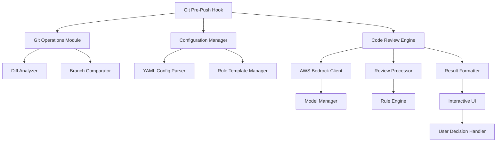

# AI-Powered Git Pre-Push Hook Architecture

## Project Overview

This project implements a pre-push git hook that performs automated code review using AWS Bedrock APIs. The hook compares local changes with remote branches and provides interactive feedback to developers.

## Core Requirements

1. **Git Integration**: Compare changes between local and remote branches
2. **AWS Bedrock Integration**: Configurable AI models for code review
3. **Configurable Rules**: YAML/JSON configuration with rule templates
4. **Interactive Mode**: Show results and prompt user to continue or abort
5. **Two Use Cases**:
   - Compare with target remote branch (where pushing to)
   - Compare with specified branch (default: main)

## System Architecture



## Project Structure

```
ai-code-review-git-hook/
├── src/
│   ├── __init__.py
│   ├── main.py                    # Entry point for the hook
│   ├── config/
│   │   ├── __init__.py
│   │   ├── manager.py             # Configuration management
│   │   └── validator.py           # Config validation
│   ├── git/
│   │   ├── __init__.py
│   │   ├── operations.py          # Git diff and branch operations
│   │   └── analyzer.py            # Change analysis
│   ├── bedrock/
│   │   ├── __init__.py
│   │   ├── client.py              # AWS Bedrock integration
│   │   └── models.py              # Model management
│   ├── review/
│   │   ├── __init__.py
│   │   ├── engine.py              # Core review logic
│   │   ├── rules.py               # Rule processing
│   │   └── formatter.py           # Result formatting
│   ├── ui/
│   │   ├── __init__.py
│   │   └── interactive.py         # Interactive user interface
│   └── utils/
│       ├── __init__.py
│       ├── logging.py             # Logging utilities
│       └── exceptions.py          # Custom exceptions
├── config/
│   ├── default.yaml               # Default configuration
│   └── templates/
│       ├── python.yaml            # Python-specific rules
│       ├── javascript.yaml        # JavaScript-specific rules
│       └── general.yaml           # General code review rules
├── hooks/
│   └── pre-push                   # The actual git hook script
├── install/
│   ├── setup.py                   # Installation script
│   └── requirements.txt           # Python dependencies
├── tests/
│   ├── __init__.py
│   ├── test_config.py
│   ├── test_git.py
│   ├── test_bedrock.py
│   └── test_review.py
├── docs/
│   ├── README.md
│   ├── configuration.md
│   └── setup.md
└── examples/
    ├── config-examples/
    └── rule-templates/
```

## Component Design

### 1. Configuration System (`src/config/`)

**Features:**
- YAML-based configuration with schema validation
- Hierarchical config loading: project → user → global → defaults
- Rule templates for different languages and frameworks
- Environment-specific overrides

**Configuration Schema:**
```yaml
bedrock:
  region: "us-east-1"
  model: "anthropic.claude-3-5-sonnet-20241022-v2:0"
  max_tokens: 4000
  temperature: 0.1

git:
  default_compare_branch: "main"
  max_diff_size: 10000  # lines
  exclude_patterns:
    - "*.min.js"
    - "package-lock.json"
    - "*.generated.*"

review:
  rules:
    - security
    - performance
    - maintainability
    - style
  severity_threshold: "warning"
  max_issues_per_file: 10

ui:
  show_diff_context: true
  color_output: true
  interactive_mode: true
```

### 2. Git Operations (`src/git/`)

**Features:**
- Diff analysis between local and remote branches
- Support for both use cases (target branch vs main)
- File change categorization (added, modified, deleted)
- Smart chunking for large diffs
- Branch existence validation

**Key Functions:**
- `get_diff_with_remote()` - Compare with push target
- `get_diff_with_branch()` - Compare with specified branch
- `analyze_changes()` - Categorize and filter changes
- `chunk_diff()` - Split large diffs for processing

### 3. AWS Bedrock Integration (`src/bedrock/`)

**Features:**
- Configurable model selection (Claude, Llama, etc.)
- Credential management via AWS CLI/environment/IAM roles
- Rate limiting and retry logic
- Cost optimization through intelligent chunking
- Error handling for API failures

**Supported Models:**
- Claude 3.5 Sonnet
- Claude 3 Haiku
- Llama models
- Configurable model parameters

### 4. Review Engine (`src/review/`)

**Features:**
- Rule-based processing with customizable criteria
- Context-aware analysis (file types, change patterns)
- Severity levels (error, warning, info, suggestion)
- Batch processing for multiple files
- Template-based prompt generation

**Review Process:**
1. Load applicable rules based on file types
2. Generate context-aware prompts
3. Send to Bedrock API with appropriate model
4. Parse and categorize results
5. Apply severity filtering
6. Format for user presentation

### 5. Interactive Interface (`src/ui/`)

**Features:**
- Colored terminal output for better readability
- Structured review results with file-by-file breakdown
- User prompts for continue/abort decisions
- Summary statistics and recommendations
- Progress indicators for long operations

**User Experience Flow:**
1. Show hook initialization
2. Display diff analysis progress
3. Present review results by file
4. Show summary with statistics
5. Prompt for user decision
6. Handle continue/abort logic

### 6. Rule Template System

**Template Structure:**
Each rule template defines:
- Review criteria specific to language/framework
- Prompt templates for the AI model
- Severity mappings for different issue types
- File pattern matching for when to apply rules

**Example Python Template:**
```yaml
name: "Python Code Review"
file_patterns:
  - "*.py"
rules:
  security:
    prompt: "Review for security vulnerabilities, SQL injection, XSS, etc."
    severity: "error"
  performance:
    prompt: "Check for performance issues, inefficient algorithms, memory leaks"
    severity: "warning"
  style:
    prompt: "Verify PEP 8 compliance and Python best practices"
    severity: "info"
```

## Installation and Setup

### Installation Process:
1. Clone repository
2. Run setup script to install dependencies
3. Configure AWS credentials
4. Set up git hook in target repository
5. Customize configuration as needed

### Setup Script Features:
- Automatic dependency installation
- Git hook installation
- Configuration file generation
- AWS credential validation
- Initial configuration wizard

## Error Handling and Logging

**Comprehensive Error Handling:**
- Network connectivity issues
- AWS API failures
- Git operation errors
- Configuration validation errors
- File system permissions

**Logging System:**
- Configurable log levels
- Structured logging with context
- Performance metrics
- Error tracking and reporting
- Debug mode for troubleshooting

## Testing Strategy

**Test Coverage:**
- Unit tests for all core components
- Integration tests for AWS Bedrock
- Git operation testing with mock repositories
- Configuration validation tests
- End-to-end workflow testing

## Security Considerations

- Secure credential handling
- No sensitive data in logs
- Configurable data retention
- Rate limiting to prevent abuse
- Input validation and sanitization

## Performance Optimization

- Intelligent diff chunking
- Parallel processing where possible
- Caching of configuration and templates
- Efficient git operations
- Optimized API calls to reduce costs

This architecture provides a robust, extensible, and user-friendly solution for AI-powered code review in git workflows.