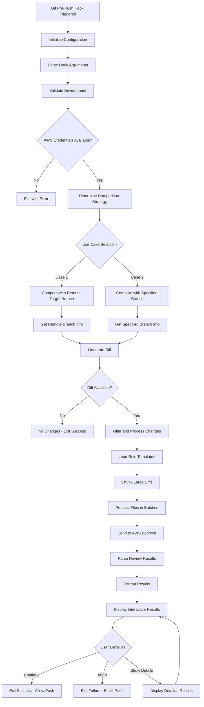

# Workflow Specification

## Overview

This document describes the detailed workflow of the AI-powered git pre-push hook, from initialization to completion. It covers both use cases: comparing with the target remote branch and comparing with a specified branch (default: main).

## Hook Execution Flow



## Detailed Workflow Steps

### 1. Hook Initialization

**Trigger**: Git executes the pre-push hook before pushing commits.

**Hook Arguments Received**:
```bash
# Arguments passed to pre-push hook
# $1 = remote name (e.g., "origin")
# $2 = remote URL (e.g., "git@github.com:user/repo.git")
# stdin = list of refs being pushed
```

**Initialization Process**:
```python
def initialize_hook():
    # Parse command line arguments
    remote_name = sys.argv[1]
    remote_url = sys.argv[2]
    
    # Read refs from stdin
    refs = parse_push_refs(sys.stdin)
    
    # Initialize configuration
    config = ConfigManager()
    
    # Setup logging
    setup_logging(config.get('logging'))
    
    # Validate environment
    validate_environment(config)
    
    return HookContext(remote_name, remote_url, refs, config)
```

### 2. Environment Validation

**Checks Performed**:
- Git repository validation
- AWS credentials availability
- Python dependencies
- Configuration file validity
- Network connectivity (optional)

```python
def validate_environment(config):
    # Check if we're in a git repository
    if not is_git_repository():
        raise EnvironmentError("Not in a git repository")
    
    # Validate AWS credentials
    if not validate_aws_credentials(config.get('bedrock')):
        raise EnvironmentError("AWS credentials not configured")
    
    # Check required dependencies
    validate_dependencies()
    
    # Validate configuration
    is_valid, errors = config.validate()
    if not is_valid:
        raise ConfigurationError(f"Invalid configuration: {errors}")
```

### 3. Comparison Strategy Selection

**Use Case 1: Compare with Remote Target Branch**
```python
def compare_with_remote_target(context):
    """Compare local changes with the remote branch being pushed to"""
    
    for ref in context.refs:
        local_ref = ref['local_ref']
        remote_ref = ref['remote_ref']
        
        # Get the remote branch name (e.g., "main" from "refs/heads/main")
        remote_branch = extract_branch_name(remote_ref)
        
        # Fetch latest remote state
        run_git_command(f"git fetch {context.remote_name} {remote_branch}")
        
        # Generate diff between local and remote
        remote_commit = f"{context.remote_name}/{remote_branch}"
        diff = get_git_diff(local_ref, remote_commit)
        
        return process_diff(diff, context)
```

**Use Case 2: Compare with Specified Branch**
```python
def compare_with_specified_branch(context):
    """Compare local changes with a specified branch (default: main)"""
    
    compare_branch = context.config.get('git.default_compare_branch', 'main')
    
    # Check if compare branch exists locally
    if not branch_exists_locally(compare_branch):
        # Try to fetch from remote
        try:
            run_git_command(f"git fetch {context.remote_name} {compare_branch}")
        except GitError:
            logger.warning(f"Could not fetch {compare_branch}, using local HEAD")
            compare_branch = "HEAD"
    
    # Generate diff
    diff = get_git_diff("HEAD", f"{context.remote_name}/{compare_branch}")
    
    return process_diff(diff, context)
```

### 4. Diff Generation and Processing

**Git Diff Analysis**:
```python
def get_git_diff(local_ref, remote_ref):
    """Generate comprehensive diff between two refs"""
    
    # Get list of changed files
    changed_files = run_git_command(
        f"git diff --name-status {remote_ref}..{local_ref}"
    ).strip().split('\n')
    
    # Get detailed diff for each file
    diffs = {}
    for file_line in changed_files:
        if not file_line:
            continue
            
        status, filename = file_line.split('\t', 1)
        
        # Get file diff
        file_diff = run_git_command(
            f"git diff {remote_ref}..{local_ref} -- {filename}"
        )
        
        diffs[filename] = {
            'status': status,  # A=added, M=modified, D=deleted
            'diff': file_diff,
            'lines_added': count_added_lines(file_diff),
            'lines_removed': count_removed_lines(file_diff)
        }
    
    return diffs
```

**Change Filtering**:
```python
def filter_changes(diffs, config):
    """Filter changes based on configuration"""
    
    filtered_diffs = {}
    exclude_patterns = config.get('git.exclude_patterns', [])
    include_patterns = config.get('git.include_patterns', [])
    max_diff_size = config.get('git.max_diff_size', 10000)
    
    for filename, diff_info in diffs.items():
        # Skip if matches exclude patterns
        if any(fnmatch.fnmatch(filename, pattern) for pattern in exclude_patterns):
            logger.debug(f"Excluding {filename} (matches exclude pattern)")
            continue
        
        # Skip if doesn't match include patterns (if specified)
        if include_patterns and not any(fnmatch.fnmatch(filename, pattern) for pattern in include_patterns):
            logger.debug(f"Excluding {filename} (doesn't match include pattern)")
            continue
        
        # Skip if diff is too large
        total_lines = diff_info['lines_added'] + diff_info['lines_removed']
        if total_lines > max_diff_size:
            logger.warning(f"Skipping {filename} (diff too large: {total_lines} lines)")
            continue
        
        # Skip binary files
        if is_binary_file(filename, config):
            logger.debug(f"Skipping {filename} (binary file)")
            continue
        
        filtered_diffs[filename] = diff_info
    
    return filtered_diffs
```

### 5. Rule Template Loading

**Template Selection Process**:
```python
def load_rule_templates(filename, config):
    """Load applicable rule templates for a file"""
    
    rule_templates = config.get('review.rule_templates', {})
    applicable_templates = []
    
    # Find matching patterns
    for pattern, templates in rule_templates.items():
        if fnmatch.fnmatch(filename, pattern):
            applicable_templates.extend(templates)
    
    # Load template files
    loaded_templates = []
    for template_name in applicable_templates:
        template_path = f"config/templates/{template_name}.yaml"
        if os.path.exists(template_path):
            with open(template_path, 'r') as f:
                template = yaml.safe_load(f)
                loaded_templates.append(template)
    
    return merge_templates(loaded_templates)
```

### 6. AWS Bedrock Integration

**Review Request Processing**:
```python
def process_file_review(filename, diff_info, templates, config):
    """Send file changes to AWS Bedrock for review"""
    
    bedrock_client = get_bedrock_client(config)
    
    # Build review prompt
    prompt = build_review_prompt(filename, diff_info, templates)
    
    # Prepare request
    request = {
        "modelId": config.get('bedrock.model'),
        "contentType": "application/json",
        "accept": "application/json",
        "body": json.dumps({
            "anthropic_version": "bedrock-2023-05-31",
            "max_tokens": config.get('bedrock.max_tokens', 4000),
            "temperature": config.get('bedrock.temperature', 0.1),
            "messages": [
                {
                    "role": "user",
                    "content": prompt
                }
            ]
        })
    }
    
    # Send request with retry logic
    response = send_with_retry(bedrock_client, request, config)
    
    # Parse response
    return parse_bedrock_response(response, filename)
```

**Prompt Construction**:
```python
def build_review_prompt(filename, diff_info, templates):
    """Build comprehensive review prompt"""
    
    prompt_parts = [
        "You are an expert code reviewer. Please review the following code changes:",
        f"\nFile: {filename}",
        f"Change Type: {diff_info['status']}",
        f"Lines Added: {diff_info['lines_added']}",
        f"Lines Removed: {diff_info['lines_removed']}",
        "\nCode Changes:",
        "```diff",
        diff_info['diff'],
        "```",
        "\nPlease review according to these criteria:"
    ]
    
    # Add rule-specific prompts
    for rule_name, rule_config in templates.get('rules', {}).items():
        if rule_config.get('enabled', True):
            prompt_parts.append(f"\n{rule_name.upper()}:")
            prompt_parts.append(rule_config['prompt'])
    
    prompt_parts.extend([
        "\nProvide your review in the following JSON format:",
        """{
            "issues": [
                {
                    "rule": "security|performance|maintainability|style|documentation",
                    "severity": "error|warning|info|suggestion",
                    "line": <line_number>,
                    "message": "Description of the issue",
                    "suggestion": "How to fix it (optional)"
                }
            ],
            "summary": "Overall assessment of the changes"
        }"""
    ])
    
    return '\n'.join(prompt_parts)
```

### 7. Result Processing and Display

**Interactive Results Display**:
```python
def display_interactive_results(review_results, config):
    """Display results and handle user interaction"""
    
    # Display summary
    display_summary(review_results)
    
    # Display issues by file
    for filename, file_results in review_results.items():
        display_file_results(filename, file_results, config)
    
    # Get user decision
    while True:
        choice = prompt_user_choice([
            "Continue with push (c)",
            "Abort push (a)",
            "Show detailed results (d)",
            "Show help (h)"
        ])
        
        if choice == 'c':
            return True  # Allow push
        elif choice == 'a':
            return False  # Block push
        elif choice == 'd':
            display_detailed_results(review_results)
        elif choice == 'h':
            display_help()
```

**Result Formatting**:
```python
def format_issue(issue, config):
    """Format a single issue for display"""
    
    severity_colors = {
        'error': 'red',
        'warning': 'yellow',
        'info': 'blue',
        'suggestion': 'green'
    }
    
    color = severity_colors.get(issue['severity'], 'white')
    
    if config.get('ui.color_output', True):
        severity_text = colored(issue['severity'].upper(), color)
    else:
        severity_text = issue['severity'].upper()
    
    output = [
        f"  [{severity_text}] Line {issue.get('line', '?')}: {issue['message']}"
    ]
    
    if issue.get('suggestion'):
        output.append(f"    Suggestion: {issue['suggestion']}")
    
    return '\n'.join(output)
```

### 8. Error Handling and Recovery

**Comprehensive Error Handling**:
```python
def handle_errors(func):
    """Decorator for comprehensive error handling"""
    
    def wrapper(*args, **kwargs):
        try:
            return func(*args, **kwargs)
        except GitError as e:
            logger.error(f"Git operation failed: {e}")
            return exit_with_error("Git operation failed", 1)
        except AWSError as e:
            logger.error(f"AWS Bedrock error: {e}")
            return exit_with_error("AI review service unavailable", 2)
        except ConfigurationError as e:
            logger.error(f"Configuration error: {e}")
            return exit_with_error("Configuration error", 3)
        except NetworkError as e:
            logger.error(f"Network error: {e}")
            return exit_with_error("Network connectivity issue", 4)
        except Exception as e:
            logger.exception(f"Unexpected error: {e}")
            return exit_with_error("Unexpected error occurred", 99)
    
    return wrapper
```

### 9. Performance Optimization

**Parallel Processing**:
```python
def process_files_parallel(diffs, templates, config):
    """Process multiple files in parallel"""
    
    max_workers = config.get('performance.max_workers', 4)
    batch_size = config.get('review.batch_size', 5)
    
    results = {}
    
    with ThreadPoolExecutor(max_workers=max_workers) as executor:
        # Submit batches of files
        futures = []
        for i in range(0, len(diffs), batch_size):
            batch = dict(list(diffs.items())[i:i+batch_size])
            future = executor.submit(process_file_batch, batch, templates, config)
            futures.append(future)
        
        # Collect results
        for future in as_completed(futures):
            batch_results = future.result()
            results.update(batch_results)
    
    return results
```

### 10. Exit Codes and Status

**Standardized Exit Codes**:
- `0`: Success - Allow push to continue
- `1`: Git operation error
- `2`: AWS Bedrock service error
- `3`: Configuration error
- `4`: Network connectivity error
- `5`: User aborted push
- `99`: Unexpected error

This workflow ensures robust, reliable operation of the git hook while providing a smooth user experience and comprehensive error handling.